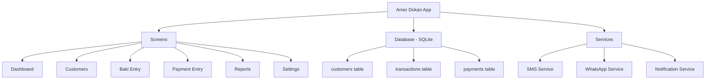

# Amer Dokan — বাকি খাতা (Credit Ledger App)

একটি সম্পূর্ণ অফলাইন Flutter অ্যাপ, মুদি দোকানের জন্য প্রতিদিনের বাকি হিসাব, পেমেন্ট ট্র্যাকিং, এবং মাস শেষে SMS/WhatsApp নোটিফিকেশন।

## 🎯 Core Features

| # | Feature | Description |
|---|---------|-------------|
| 1 | **Customer Management** | গ্রাহক তৈরি/সম্পাদনা/মুছুন — নাম, ফোন নম্বর, ঠিকানা |
| 2 | **Daily Baki Entry** | প্রতিদিন কোন গ্রাহককে কত টাকা বাকি দিলাম তার হিসাব |
| 3 | **Payment Collection** | বাকি থেকে কত টাকা আদায় হলো তার ট্র্যাকিং |
| 4 | **Sales Tracking** | প্রতিদিন কতটা পণ্য বিক্রি হলো (ক্যাশ + বাকি) |
| 5 | **Dashboard** | মোট বাকি, আজকের বাকি, আজকের আদায়, মাসিক সারসংক্ষেপ |
| 6 | **Month-End SMS** | মাস শেষে স্বয়ংক্রিয়ভাবে SMS পাঠানো — "আপনার বাকি X টাকা" |
| 7 | **WhatsApp Notification** | WhatsApp এ বাকির তথ্য পাঠানো |
| 8 | **Reports** | দৈনিক, সাপ্তাহিক, মাসিক রিপোর্ট |

## 📱 App Architecture



## 🗄️ Database Schema (SQLite)

### Table: `customers`
| Column | Type | Description |
|--------|------|-------------|
| id | INTEGER PK | Auto-increment |
| name | TEXT | গ্রাহকের নাম |
| phone | TEXT | ফোন নম্বর |
| address | TEXT | ঠিকানা (optional) |
| photo_path | TEXT | গ্রাহকের ছবি path (optional) |
| created_at | TEXT | তৈরির তারিখ |
| total_baki | REAL | মোট বাকি (computed, cached) |

### Table: `transactions` (বাকি এন্ট্রি)
| Column | Type | Description |
|--------|------|-------------|
| id | INTEGER PK | Auto-increment |
| customer_id | INTEGER FK | গ্রাহক reference |
| amount | REAL | বাকির পরিমাণ (টাকা) |
| description | TEXT | কি কিনেছে (optional) |
| date | TEXT | তারিখ |
| created_at | TEXT | তৈরির সময় |

### Table: `payments` (আদায়)
| Column | Type | Description |
|--------|------|-------------|
| id | INTEGER PK | Auto-increment |
| customer_id | INTEGER FK | গ্রাহক reference |
| amount | REAL | আদায়ের পরিমাণ |
| date | TEXT | তারিখ |
| note | TEXT | নোট (optional) |
| created_at | TEXT | তৈরির সময় |

## 🎨 UI Design — Premium Dark Theme

### Design System
- **Primary Color**: Deep Emerald Green (`#00C853`) — টাকা/ব্যবসা theme
- **Background**: Rich Dark (`#0A0E21` → `#1A1A2E`) gradient
- **Surface**: Glassmorphism cards with blur + transparency
- **Accent**: Golden Yellow (`#FFD700`) for highlights
- **Typography**: Google Fonts `Hind Siliguri` (Bengali support) + `Poppins` (English/Numbers)
- **Cards**: Rounded corners (16px), subtle shadows, gradient borders
- **Animations**: Smooth page transitions, card hover effects, number counting animations

### Screen Breakdown

#### 1. Dashboard (Home)
- Top greeting bar: "আমের দোকান 🏪" with date
- 4 summary cards (glassmorphism):
  - 💰 মোট বাকি (Total Due)
  - 📥 আজকের বাকি (Today's Credit)
  - 📤 আজকের আদায় (Today's Collection)
  - 📊 এই মাসের বিক্রি (This Month's Sales)
- Recent transactions list
- Quick action FAB: + বাকি দিন / + আদায় করুন

#### 2. Customers List
- Search bar with filter
- Customer cards: নাম, ফোন, মোট বাকি
- Color-coded baki amount (red = high, green = low/zero)
- Tap → Customer detail page

#### 3. Customer Detail
- Customer info header with avatar
- Baki summary card
- Transaction history (timeline view)
- Action buttons: SMS পাঠান, WhatsApp পাঠান, বাকি দিন, আদায় করুন

#### 4. Add Baki / Add Payment
- Clean form with amount input (large number pad style)
- Customer selector (searchable dropdown)
- Date picker
- Optional notes
- Save with confirmation animation

#### 5. Reports
- Date range selector
- Charts (bar chart for daily sales)
- Customer-wise baki summary
- Export option

#### 6. Settings
- SMS template customization
- WhatsApp message template
- Month-end reminder toggle
- App theme toggle (dark/light)
- Data backup/restore

## 📦 Dependencies

| Package | Purpose |
|---------|---------|
| `sqflite` | SQLite local database |
| `path_provider` | App directory for DB file |
| `url_launcher` | WhatsApp & SMS deep links |
| `intl` | Date formatting & localization |
| `google_fonts` | Hind Siliguri + Poppins fonts |
| `fl_chart` | Charts for reports |
| `flutter_local_notifications` | Month-end reminder notifications |
| `share_plus` | Share reports |
| `provider` | State management |
| `permission_handler` | SMS/Phone permissions |

## 📂 Project Structure

```
lib/
├── main.dart
├── app.dart
├── theme/
│   ├── app_theme.dart          # Dark/Light theme definitions
│   └── app_colors.dart         # Color constants
├── models/
│   ├── customer.dart
│   ├── transaction.dart
│   └── payment.dart
├── database/
│   ├── database_helper.dart    # SQLite CRUD operations
│   └── tables.dart             # Table creation SQL
├── providers/
│   ├── customer_provider.dart
│   ├── transaction_provider.dart
│   └── dashboard_provider.dart
├── screens/
│   ├── dashboard/
│   │   └── dashboard_screen.dart
│   ├── customers/
│   │   ├── customer_list_screen.dart
│   │   └── customer_detail_screen.dart
│   ├── baki/
│   │   └── add_baki_screen.dart
│   ├── payment/
│   │   └── add_payment_screen.dart
│   ├── reports/
│   │   └── reports_screen.dart
│   └── settings/
│       └── settings_screen.dart
├── widgets/
│   ├── glass_card.dart         # Glassmorphism card widget
│   ├── summary_card.dart       # Dashboard summary cards
│   ├── customer_tile.dart      # Customer list item
│   ├── transaction_tile.dart   # Transaction list item
│   └── bottom_nav_bar.dart     # Custom bottom navigation
└── services/
    ├── sms_service.dart        # SMS sending via url_launcher
    ├── whatsapp_service.dart   # WhatsApp message sending
    └── notification_service.dart # Local notifications
```

## 🔧 SMS & WhatsApp Implementation

### SMS (via `url_launcher`)
```
sms:+8801XXXXXXXXX?body=আমের দোকান থেকে জানাচ্ছি, আপনার বাকি ৳500 টাকা। অনুগ্রহ করে পরিশোধ করুন।
```
> [!NOTE]
> Since the app is fully offline, SMS will open the device's native SMS app with pre-filled message. The user just needs to tap send.

### WhatsApp (via `url_launcher`)
```
https://wa.me/8801XXXXXXXXX?text=আমের দোকান থেকে জানাচ্ছি, আপনার বাকি ৳500 টাকা। অনুগ্রহ করে পরিশোধ করুন।
```

### Month-End Auto Reminder
- Use `flutter_local_notifications` to schedule a notification on the last day of each month
- Notification will remind the shop owner to send baki messages
- Tap notification → opens a "Send All Reminders" screen showing all customers with baki > 0
- Bulk send option: send SMS/WhatsApp to all customers with one tap

## 🚀 Proposed Changes

### Phase 1: Project Setup & Database
1. Create Flutter project with `flutter create`
2. Set up dependencies in `pubspec.yaml`
3. Implement SQLite database helper with all CRUD operations
4. Create data models

### Phase 2: Core UI
5. Implement theme system (dark glassmorphism theme)
6. Build Dashboard screen with summary cards
7. Build Customer list + detail screens
8. Build Add Baki screen
9. Build Add Payment screen
10. Build bottom navigation

### Phase 3: Services & Features
11. Implement SMS service
12. Implement WhatsApp service
13. Build Reports screen with charts
14. Build Settings screen
15. Implement month-end notification

### Phase 4: Polish
16. Add animations and transitions
17. Add empty states and loading indicators
18. Test and fix edge cases

## ✅ Verification Plan

### Automated Tests
- Run `flutter analyze` to check for code issues
- Run the app on available device/emulator

### Manual Verification
- Test all CRUD operations (add/edit/delete customers, baki, payments)
- Verify SMS and WhatsApp deep links work
- Check dashboard calculations
- Test offline functionality (should work without internet)

## Open Questions

> [!IMPORTANT]
> 1. **ভাষা (Language)**: অ্যাপটি কি সম্পূর্ণ বাংলায় হবে নাকি English + বাংলা মিক্স? (আমি বাংলা + English mix ধরে নিচ্ছি)
> 2. **টার্গেট প্ল্যাটফর্ম**: শুধু Android নাকি iOS ও? (আমি Android ধরে নিচ্ছি)
> 3. **ডাটা ব্যাকআপ**: ডাটা ব্যাকআপ/রিস্টোর ফিচার কি দরকার? (আমি রাখছি settings এ)
